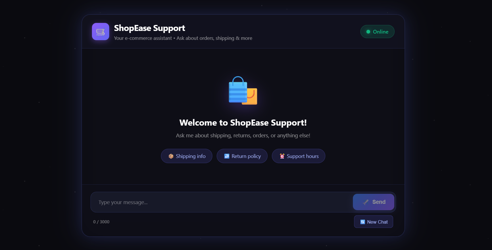

# 🤖 AI Chatbot - Full Stack Application

A simple AI chatbot built with **Spring Boot** and **React**, powered by **Groq AI**.

🔗 **Live Demo:** [https://chatbot-backend-t2mm.onrender.com](https://chatbot-backend-t2mm.onrender.com)


---

## ✨ Features

- 💬 **AI-Powered Chat** - Intelligent responses using LLaMA 3.1 model
- 🎨 **Beautiful UI** - Modern, responsive design with smooth animations
- 💾 **Chat History** - Conversations saved in PostgreSQL database
- ⚡ **Fast Responses** - Powered by Groq's ultra-fast AI inference
- 📱 **Mobile Friendly** - Works great on all devices

---

## 📸 Screenshots

### Welcome Screen

*ShopEase Support chatbot welcome interface with quick action buttons for common queries*

### Chat Conversation

*AI-powered conversation showing user messages and intelligent bot responses*

---

## 🏗️ Architecture

```
┌─────────────────┐         ┌─────────────────┐         ┌─────────────────┐
│                 │  HTTP   │                 │  HTTP   │                 │
│     React       │────────▶│   Spring Boot   │────────▶│    Groq AI      │
│    Frontend     │◀────────│     Backend     │◀────────│    Service      │
│                 │         │                 │         │                 │
└─────────────────┘         └────────┬────────┘         └─────────────────┘
                                     │
                                     │ JPA
                                     ▼
                            ┌─────────────────┐
                            │   PostgreSQL    │
                            │    Database     │
                            └─────────────────┘
```

---

## 📁 Project Structure

```
AI-chatBot/
├── backend/                      # Spring Boot Backend
│   ├── src/main/java/com/chatbot/
│   │   ├── controller/           # REST API endpoints
│   │   ├── service/              # Business logic
│   │   ├── entity/               # Database models
│   │   ├── dto/                  # Data transfer objects
│   │   ├── repository/           # Database access
│   │   └── config/               # Configurations
│   └── src/main/resources/
│       └── application.yml       # App configuration
│
├── frontend/                     # React Frontend
│   ├── src/
│   │   ├── components/           # UI Components
│   │   ├── services/             # API calls
│   │   └── types/                # TypeScript types
│   └── package.json
│
├── INTERVIEW_QUESTIONS.md        # Interview prep guide
└── README.md                     # This file
```

---

## 🚀 Getting Started

### Prerequisites

| Tool | Version | Download |
|------|---------|----------|
| Java | 17+ | [Adoptium](https://adoptium.net/) |
| Node.js | 18+ | [nodejs.org](https://nodejs.org/) |
| MySQL | 8.0+ | [mysql.com](https://dev.mysql.com/downloads/) |
| Groq API Key | - | [console.groq.com](https://console.groq.com/keys) |

### Step 1: Clone Repository

```bash
git clone https://github.com/yourusername/AI-chatbot.git
cd AI-chatbot
```

### Step 2: Setup Database

```sql
CREATE DATABASE chatbot_db;
```

### Step 3: Configure Backend

Create `backend/.env` file:

```env
LLM_API_KEY=your_groq_api_key_here
```

### Step 4: Run Backend

```bash
cd backend
mvn spring-boot:run
```

Backend runs on: http://localhost:8081

### Step 5: Run Frontend

```bash
cd frontend
npm install
npm run dev
```

Frontend runs on: http://localhost:5173

---

## 🌐 API Endpoints

| Method | Endpoint | Description |
|--------|----------|-------------|
| POST | `/api/chat` | Send message, get AI response |
| POST | `/api/conversations` | Create new conversation |
| GET | `/api/conversations/{id}` | Get conversation details |
| GET | `/api/conversations/{id}/messages` | Get all messages |
| GET | `/api/health` | Health check |

### Example Request

```bash
curl -X POST http://localhost:8081/api/chat \
  -H "Content-Type: application/json" \
  -d '{"message": "Hello, how are you?"}'
```

---

## 🚢 Deployment

This app is deployed on **Render.com** (free tier).

### Environment Variables (Render)

| Variable | Description |
|----------|-------------|
| `DATABASE_URL` | PostgreSQL connection string |
| `LLM_API_KEY` | Groq API key |
| `SPRING_PROFILES_ACTIVE` | `production` |

---

## 🛠️ Tech Stack

### Backend
- **Java 17** - Programming language
- **Spring Boot 3.2** - Web framework
- **Spring Data JPA** - Database ORM
- **Hibernate** - JPA implementation
- **PostgreSQL** - Production database
- **Maven** - Build tool

### Frontend
- **React 18** - UI library
- **TypeScript** - Type-safe JavaScript
- **Vite** - Build tool
- **Axios** - HTTP client

### AI
- **Groq API** - AI inference service
- **LLaMA 3.1 8B** - AI model

---

## 📚 Learning Resources

- [Spring Boot Documentation](https://spring.io/projects/spring-boot)
- [React Documentation](https://react.dev/)
- [TypeScript Handbook](https://www.typescriptlang.org/docs/)
- [Groq API Documentation](https://console.groq.com/docs/quickstart)

---

## 📝 Interview Preparation

See [INTERVIEW_QUESTIONS.md](./INTERVIEW_QUESTIONS.md) for common interview questions about this project.

---

## 🤝 Contributing

1. Fork the repository
2. Create a feature branch (`git checkout -b feature/amazing`)
3. Commit changes (`git commit -m 'Add amazing feature'`)
4. Push to branch (`git push origin feature/amazing`)
5. Open a Pull Request

---

## 📄 License

MIT License - feel free to use this project for learning!

---

## 👨‍💻 Author

Built with ❤️ for learning full-stack development.

**Happy Coding!** 🚀
